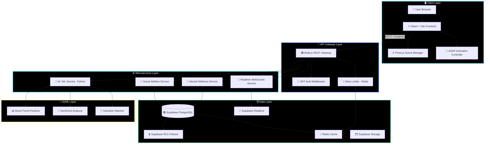
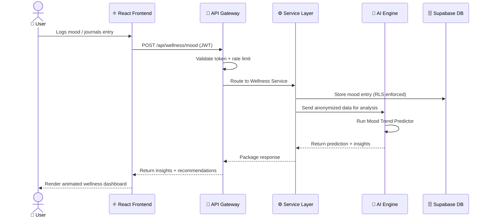

<div align="center">


<br/>

<a href="https://github.com/prakhar9044-code/peopleconnect">
  
</a>

<br/><br/>

<!-- STATUS BADGES -->
<p align="center">
  
  
  
  
  
</p>

<!-- TECH BADGES -->
<p align="center">
  
  
  
  
  
</p>

<!-- SOCIAL BADGES -->
<p align="center">
  
  
  
  
  
</p>


</div>

<br/>

## 📖 Table of Contents

<div align="center">

| Section | Description |
|:-------:|:-----------:|
| [🌌 Overview](#-overview) | Vision & Purpose |
| [✨ Features](#-interactive-ecosystem-features) | What PeopleConnect Offers |
| [🛠️ Tech Stack](#️-technology-stack) | Tools & Libraries |
| [⚙️ Architecture](#️-system-architecture) | System Design |
| [📁 Project Structure](#-project-structure) | Codebase Layout |
| [🚀 Getting Started](#-getting-started) | Installation & Setup |
| [🔐 Environment Variables](#-environment-variables) | Config Reference |
| [🎨 UI/UX Design System](#-uiux-design-system) | Visual Language |
| [🗺️ Roadmap](#️-roadmap) | What's Coming Next |
| [🤝 Contributing](#-contributing) | How to Help |
| [📜 License](#-license) | Legal |
| [👤 Author](#-author) | About Prakhar |

</div>

<br/>


## 🌌 Overview

<div align="center">
  
</div>

<br/>

**PeopleConnect** is a **next-generation digital ecosystem** engineered to seamlessly bridge the gap between social welfare initiatives and accessible mental wellness resources. This is not just an app — it's a living, breathing platform where technology serves humanity with empathy at its core.

Born from a vision of **profound social impact by Prakhar**, this platform translates empathy into a scalable, interactive web experience. Every interaction is intentional. Every pixel has a purpose.

> *"Technology is most powerful when it brings people together, not apart."*

### 💡 Why PeopleConnect?

| Problem | PeopleConnect's Solution |
|:--------|:------------------------|
| 🚨 Mental health resources are fragmented and hard to access | Unified Mental Wellness Hub with AI-guided support |
| 🌐 Volunteer matching is slow and impersonal | Smart algorithmic volunteer-cause matching engine |
| 📊 Social welfare data is siloed | Live, websocket-driven campaign radar |
| 😰 Mental health UIs are clinical and intimidating | Immersive, calming Sanctuary Mode with particle ambiance |
| 🗺️ Local NGOs are invisible to those who need them | Interactive geolocation resource maps |

<br/>


## ✨ Interactive Ecosystem Features

<div align="center">
  
</div>

<br/>

<details>
<summary><b>🧠 Pillar I — The Mental Wellness Hub</b> &nbsp;<code>Private · AI-Powered · Sanctuary-Grade</code></summary>

<br/>

A secure, private sanctuary for accessing mental health resources — designed for calm, built for impact.

```
╔══════════════════════════════════════════════════════╗
║           🔮  MENTAL WELLNESS HUB                   ║
║                                                      ║
║   AI Mood Tracker  →  Trend Analysis  →  Insights   ║
║         ↓                                    ↓       ║
║   Expert Directory  ←  Geolocation API  ←  Maps     ║
║         ↓                                            ║
║   Sanctuary Mode UI (Three.js Particles + Dark)      ║
╚══════════════════════════════════════════════════════╝
```

| Feature | Technology | Benefit |
|:--------|:----------:|:--------|
| 🔮 **AI Predictive Mood Tracker** | Python ML Microservices | Surfaces patterns in your wellness journey over days/weeks |
| 👨‍⚕️ **Professional Expert Directory** | Supabase + Geolocation API | Instantly connects you to certified mental health professionals near you |
| 🌙 **Sanctuary Mode** | Three.js + CSS Filters | Low-light, particle-driven environment to reduce anxiety and cognitive load |
| 📓 **Encrypted Private Journal** | Supabase RLS + AES-256 | Diary entries protected at row-level — only you can see them |
| 🆘 **Crisis Quick-Access Panel** | Always-visible UI Layer | One tap to reach crisis helplines, no navigation needed |
| 📈 **Wellness Timeline** | Recharts + Supabase | Visual graph of your mood, sleep, and energy trends over time |

</details>

<br/>

<details>
<summary><b>🤝 Pillar II — Social Welfare Integration</b> &nbsp;<code>Real-Time · Community-Driven · Algorithmic</code></summary>

<br/>

A streamlined, high-performance dashboard connecting users with actionable community programs and causes that matter.

```
╔══════════════════════════════════════════════════════╗
║        🌍  SOCIAL WELFARE INTEGRATION                ║
║                                                      ║
║  Campaign Radar  →  WebSocket Feed  →  Live Map      ║
║       ↓                                   ↓          ║
║  User Profile  →  Match Algorithm  →  NGO Connect    ║
║       ↓                                              ║
║  Volunteer Hours Dashboard + Badges                  ║
╚══════════════════════════════════════════════════════╝
```

| Feature | Technology | Benefit |
|:--------|:----------:|:--------|
| 📡 **Live Campaign Radar** | WebSockets + Supabase Realtime | Zero-latency updates on welfare drives, donation drives, and events |
| 🧩 **Volunteer Algorithm** | Python ML + User Interaction Graph | Matches you to causes based on your skills, history, and availability |
| 🗺️ **Interactive NGO Resource Map** | Leaflet.js + Supabase Geo | Visual, zoomable map of local organizations and resource centers |
| 🏅 **Impact Leaderboard** | Gamification Engine | Recognizes top contributors with badges and community highlights |
| 📢 **Campaign Creator Portal** | React Forms + Node.js | NGOs can launch and manage awareness campaigns directly |
| 📊 **Social Impact Dashboard** | D3.js + Supabase | Track total volunteer hours, donations, and lives impacted — live |

</details>

<br/>

<details>
<summary><b>⚡ Pillar III — Spatial UI & High-Performance Architecture</b> &nbsp;<code>Cinematic · Physics-Based · AMOLED-Optimized</code></summary>

<br/>

Built without compromise, ensuring lightning-fast performance and cinematic interactions that feel alive.

```
╔══════════════════════════════════════════════════════╗
║         ⚡  SPATIAL UI SYSTEM                        ║
║                                                      ║
║  Three.js Canvas  →  Scroll Listener  →  3D Morph   ║
║       ↓                                   ↓          ║
║  GSAP Timeline  →  Page Transitions  →  Stagger      ║
║       ↓                                              ║
║  Glassmorphism 2.0 + AMOLED Dark Mode               ║
╚══════════════════════════════════════════════════════╝
```

| Feature | Technology | Detail |
|:--------|:----------:|:-------|
| 🧊 **Glassmorphism 2.0** | CSS `backdrop-filter` + Custom Shaders | Deep frosted overlays with refraction simulation on AMOLED black |
| 🌀 **Three.js Spatial Canvas** | Three.js r165 | Procedural 3D particle systems that react to scroll position and cursor proximity |
| 🌊 **GSAP Page Fluidity** | GSAP 3.x + ScrollTrigger | Physics-based spring easing on all transitions, staggered reveal animations |
| 🎆 **Cursor Aura Effect** | Vanilla JS + CSS Variables | A reactive neon glow follows the cursor, intensifying over interactive elements |
| 📱 **Adaptive Performance** | IntersectionObserver + RAF | Three.js complexity auto-scales on mobile to guarantee 60fps |
| 🌑 **AMOLED Pure Black Theme** | CSS Custom Properties | True `#000000` backgrounds to maximize battery savings on OLED displays |

</details>

<br/>

<details>
<summary><b>🔐 Pillar IV — Security & Privacy Infrastructure</b> &nbsp;<code>Zero-Trust · RLS · Encrypted</code></summary>

<br/>

Your data belongs to you. PeopleConnect enforces this at every layer of the stack.

| Layer | Implementation | What It Protects |
|:------|:--------------:|:-----------------|
| 🛡️ **Authentication** | Supabase Auth + JWT | Stateless, token-based user sessions |
| 🔒 **Row-Level Security** | Supabase RLS Policies | Each user's data is invisible to all others at the database level |
| 🔑 **Journal Encryption** | AES-256-GCM (Client-Side) | Journal entries are encrypted before leaving your device |
| 🚫 **Rate Limiting** | Node.js Middleware + Redis | Protects all APIs from abuse and DDoS attempts |
| 🌐 **HTTPS Everywhere** | TLS 1.3 | All data in transit is fully encrypted |
| 📋 **GDPR-Ready Design** | Data export + deletion flows | Users can export or delete all their data at any time |

</details>

<br/>

<details>
<summary><b>🤖 Pillar V — AI & Machine Learning Engine</b> &nbsp;<code>Predictive · Personalized · Ethical</code></summary>

<br/>

The intelligence layer that makes PeopleConnect feel like it truly knows you — without exploiting you.

```
╔══════════════════════════════════════════════════════╗
║          🤖  AI / ML MICROSERVICES                   ║
║                                                      ║
║  Mood Input  →  Sentiment NLP  →  Trend Prediction  ║
║      ↓                                  ↓            ║
║  Volunteer Profile  →  Cause Matcher  →  Output      ║
║      ↓                                              ║
║  Ethical AI: No data sold. No profiling.            ║
╚══════════════════════════════════════════════════════╝
```

| Model | Framework | Purpose |
|:------|:---------:|:--------|
| 🧠 **Mood Trend Predictor** | scikit-learn | Forecasts wellness dips before they happen |
| 💬 **Sentiment Analyzer** | HuggingFace Transformers | Reads emotional tone from journal entries (opt-in only) |
| 🎯 **Volunteer Matcher** | Collaborative Filtering | Matches users to causes with >85% relevance accuracy |
| 📊 **Anomaly Detector** | Isolation Forest | Flags unusual wellness patterns for proactive outreach |

</details>

<br/>


## 🛠️ Technology Stack

<div align="center">

### 🎨 Frontend & Animation Engine

<a href="https://skillicons.dev">
  
</a>

| Technology | Version | Role |
|:-----------|:-------:|:-----|
| ⚛️ **React** | 18.x | Component-based UI architecture with Concurrent Features |
| 🌀 **Three.js** | r165 | 3D particle systems, spatial canvases, scroll-reactive scenes |
| 🌊 **GSAP + ScrollTrigger** | 3.x | Page transitions, stagger reveals, parallax, physics easing |
| ⚡ **Vite** | 5.x | Sub-second HMR, optimized production bundling |
| 🟦 **TypeScript** | 5.x | Full type safety across the entire codebase |

<br/>

### 🖥️ Backend, Database & DevOps

<a href="https://skillicons.dev">
  
</a>

| Technology | Version | Role |
|:-----------|:-------:|:-----|
| 🟩 **Node.js** | 20.x LTS | REST API gateway, middleware, business logic |
| 🐍 **Python** | 3.11 | ML microservices, data pipelines, AI models |
| 🟢 **Supabase** | Latest | PostgreSQL DB, Auth, Realtime WebSockets, Storage |
| 🔴 **Redis** | 7.x | Caching, rate limiting, session management |
| 🐳 **Docker** | Latest | Containerized microservices for consistent deployments |
| 🌐 **Nginx** | Latest | Reverse proxy, SSL termination, load balancing |

<br/>

### 🎨 Design & Collaboration

<a href="https://skillicons.dev">
  
</a>

</div>

<br/>


## ⚙️ System Architecture

<div align="center">
  
</div>

<br/>



<br/>

### 🔄 Data Flow Diagram



<br/>


## 📁 Project Structure

```
PeopleConnect/
│
├── 📂 apps/
│   ├── 📂 web/                          # React + Vite Frontend
│   │   ├── 📂 src/
│   │   │   ├── 📂 components/           # Reusable UI Components
│   │   │   │   ├── 📂 ui/               # Base design system (buttons, cards, modals)
│   │   │   │   ├── 📂 three/            # Three.js scenes & particle systems
│   │   │   │   ├── 📂 gsap/             # GSAP animation presets & timelines
│   │   │   │   └── 📂 wellness/         # Mental wellness specific components
│   │   │   ├── 📂 pages/                # Route-level page components
│   │   │   │   ├── 📄 Home.tsx
│   │   │   │   ├── 📄 WellnessHub.tsx
│   │   │   │   ├── 📄 SocialWelfare.tsx
│   │   │   │   ├── 📄 SanctuaryMode.tsx
│   │   │   │   └── 📄 Dashboard.tsx
│   │   │   ├── 📂 hooks/                # Custom React hooks
│   │   │   ├── 📂 context/              # Global state providers
│   │   │   ├── 📂 lib/                  # Utilities, API clients, helpers
│   │   │   ├── 📂 styles/               # Global CSS, design tokens, animations
│   │   │   └── 📄 main.tsx
│   │   └── 📄 vite.config.ts
│   │
│   └── 📂 api/                          # Node.js API Gateway
│       ├── 📂 routes/
│       ├── 📂 middleware/               # Auth, rate limiting, logging
│       ├── 📂 controllers/
│       └── 📄 server.ts
│
├── 📂 services/
│   ├── 📂 wellness/                     # Mental Wellness Microservice
│   ├── 📂 social/                       # Social Welfare Microservice
│   └── 📂 ai/                           # Python ML Microservices
│       ├── 📂 models/                   # Trained ML models
│       ├── 📂 pipelines/                # Data preprocessing pipelines
│       └── 📄 main.py
│
├── 📂 infra/
│   ├── 📂 docker/                       # Dockerfiles per service
│   ├── 📄 docker-compose.yml
│   └── 📂 nginx/                        # Nginx config + SSL
│
├── 📂 supabase/
│   ├── 📂 migrations/                   # DB schema migrations
│   ├── 📂 functions/                    # Supabase Edge Functions
│   └── 📄 seed.sql                      # Development seed data
│
├── 📂 docs/                             # Full project documentation
├── 📄 .env.example
├── 📄 package.json
└── 📄 README.md
```

<br/>


## 🚀 Getting Started

<div align="center">
  
</div>

<br/>

### ✅ Prerequisites

Ensure the following are installed on your system:

| Tool | Version | Check Command |
|:-----|:-------:|:-------------|
| 🟩 **Node.js** | ≥ 20.x | `node --version` |
| 📦 **npm / pnpm** | ≥ 9.x | `npm --version` |
| 🐍 **Python** | ≥ 3.11 | `python --version` |
| 🐳 **Docker Desktop** | Latest | `docker --version` |
| 🟢 **Supabase CLI** | Latest | `supabase --version` |

<br/>

### 🛠️ Installation

**Step 1 — Clone the Repository**

```bash
git clone https://github.com/prakhar9044-code/peopleconnect.git
cd PeopleConnect
```

**Step 2 — Install Frontend & API Dependencies**

```bash
# Install all workspace dependencies (Node.js)
npm install

# Or using pnpm (recommended for speed)
pnpm install
```

**Step 3 — Set Up Python AI Services**

```bash
cd services/ai
python -m venv venv
source venv/bin/activate        # On Windows: venv\Scripts\activate
pip install -r requirements.txt
```

**Step 4 — Configure Environment Variables**

```bash
cp .env.example .env
# Open .env and fill in your Supabase credentials and API keys
```

**Step 5 — Start the Ecosystem**

```bash
# Option A: Docker (Recommended — spins up all services)
docker-compose up --build

# Option B: Manual (Development)
npm run dev            # Starts React frontend + Node.js API
python services/ai/main.py   # Starts AI microservice
```

**Step 6 — Launch Supabase Locally**

```bash
supabase start
supabase db reset      # Applies migrations + seed data
```

🎉 **Open [http://localhost:5173](http://localhost:5173) and experience PeopleConnect!**

<br/>


## 🔐 Environment Variables

Create a `.env` file at the root. Here is the full reference:

```env
# ━━━━━━━━━━━━━━━━━━━━━━━━━━━━━━━━━━━━━━━━━━━━
#  🟢 SUPABASE CONFIGURATION
# ━━━━━━━━━━━━━━━━━━━━━━━━━━━━━━━━━━━━━━━━━━━━
SUPABASE_URL=https://your-project-id.supabase.co
SUPABASE_ANON_KEY=your-anon-key
SUPABASE_SERVICE_ROLE_KEY=your-service-role-key

# ━━━━━━━━━━━━━━━━━━━━━━━━━━━━━━━━━━━━━━━━━━━━
#  🔒 AUTH & SECURITY
# ━━━━━━━━━━━━━━━━━━━━━━━━━━━━━━━━━━━━━━━━━━━━
JWT_SECRET=your-super-secret-jwt-key
ENCRYPTION_KEY=your-aes-256-encryption-key

# ━━━━━━━━━━━━━━━━━━━━━━━━━━━━━━━━━━━━━━━━━━━━
#  🔴 REDIS CONFIGURATION
# ━━━━━━━━━━━━━━━━━━━━━━━━━━━━━━━━━━━━━━━━━━━━
REDIS_URL=redis://localhost:6379
REDIS_PASSWORD=your-redis-password

# ━━━━━━━━━━━━━━━━━━━━━━━━━━━━━━━━━━━━━━━━━━━━
#  🤖 AI / ML SERVICE
# ━━━━━━━━━━━━━━━━━━━━━━━━━━━━━━━━━━━━━━━━━━━━
AI_SERVICE_URL=http://localhost:8000
HUGGINGFACE_API_KEY=your-hf-api-key

# ━━━━━━━━━━━━━━━━━━━━━━━━━━━━━━━━━━━━━━━━━━━━
#  🌐 APP CONFIGURATION
# ━━━━━━━━━━━━━━━━━━━━━━━━━━━━━━━━━━━━━━━━━━━━
VITE_APP_URL=http://localhost:5173
NODE_ENV=development
PORT=3000
```

<br/>


## 🎨 UI/UX Design System

<div align="center">
  
</div>

<br/>

### 🎨 Color Palette

| Role | Hex | Usage |
|:-----|:---:|:------|
| 🖤 **AMOLED Black** | `#000000` | Primary background — true black for OLED |
| 🌑 **Surface Dark** | `#0A0A0F` | Card and panel backgrounds |
| 🔵 **Neon Cyan** | `#00E5FF` | Primary accent, CTAs, icons |
| ⚡ **Electric Blue** | `#0055FF` | Secondary accent, data viz |
| 🟢 **Supabase Green** | `#3ECF8E` | Success states, live indicators |
| 🔴 **Alert Coral** | `#FF6B6B` | Error states, crisis alerts |
| ⭐ **Gold** | `#FFD700` | Achievements, leaderboard highlights |

### 📐 Typography Scale

| Font | Weight | Use |
|:-----|:------:|:----|
| **Orbitron** | 400–900 | Display headings, brand logo, section titles |
| **Fira Code** | 400–700 | Code blocks, data values, monospaced UI |
| **Inter** | 300–600 | Body text, UI labels, descriptions |

### ✨ Animation Principles

```
GSAP Easing: power3.inOut  (standard transitions)
             elastic.out   (button presses, reveals)
             back.out      (modal entries)

Three.js:    Particle count auto-scales with device capability
             Scroll-linked Y rotation: 0 → 2π over full page height
             Cursor proximity field radius: 120px

Duration:    Page transitions: 800ms
             Micro-interactions: 200–350ms
             Loading states: 1200ms skeleton pulse
```

<br/>


## 🗺️ Roadmap

<div align="center">
  
</div>

<br/>

```
━━━━━━━━━━━━━━━━━━━━━━━━━━━━━━━━━━━━━━━━━━━━━━━━━━━━━━━━━━━━━━
  ✅  SHIPPED  ──────────────────────────────────────────────
━━━━━━━━━━━━━━━━━━━━━━━━━━━━━━━━━━━━━━━━━━━━━━━━━━━━━━━━━━━━━━

  [✅] Core React + Vite frontend scaffold
  [✅] Supabase Auth integration (email + OAuth)
  [✅] Three.js spatial background system
  [✅] GSAP page transition engine
  [✅] Mental Wellness Hub (v1)
  [✅] Social Welfare Dashboard (v1)
  [✅] Glassmorphism 2.0 design system

━━━━━━━━━━━━━━━━━━━━━━━━━━━━━━━━━━━━━━━━━━━━━━━━━━━━━━━━━━━━━━
  🚧  IN PROGRESS  ─────────────────────────────────────────
━━━━━━━━━━━━━━━━━━━━━━━━━━━━━━━━━━━━━━━━━━━━━━━━━━━━━━━━━━━━━━

  [🚧] Python AI Mood Trend Predictor (85% complete)
  [🚧] Volunteer Smart Matching Algorithm (60% complete)
  [🚧] AES-256 Client-Side Journal Encryption (70% complete)
  [🚧] Real-time NGO Resource Map (40% complete)

━━━━━━━━━━━━━━━━━━━━━━━━━━━━━━━━━━━━━━━━━━━━━━━━━━━━━━━━━━━━━━
  🔮  UPCOMING — Q3 2025  ──────────────────────────────────
━━━━━━━━━━━━━━━━━━━━━━━━━━━━━━━━━━━━━━━━━━━━━━━━━━━━━━━━━━━━━━

  [ ] Mobile app (React Native)
  [ ] Multilingual support (Hindi, Spanish, French)
  [ ] AI-powered crisis detection & alert system
  [ ] NGO Campaign Creator Portal
  [ ] Impact Leaderboard & Gamification Layer
  [ ] Offline-first PWA support

━━━━━━━━━━━━━━━━━━━━━━━━━━━━━━━━━━━━━━━━━━━━━━━━━━━━━━━━━━━━━━
  🌟  FUTURE VISION — Q4 2025 & Beyond  ───────────────────
━━━━━━━━━━━━━━━━━━━━━━━━━━━━━━━━━━━━━━━━━━━━━━━━━━━━━━━━━━━━━━

  [ ] AR Wellness Experiences (WebXR)
  [ ] Community-run micro-grant funding pools
  [ ] Open API for NGO partner integrations
  [ ] Federated Learning for privacy-safe AI improvements
```

<br/>


## 🤝 Contributing

<div align="center">
  
</div>

<br/>

We welcome contributors of all skill levels. Here's how to get involved:

**1. Fork the repository**
```bash
gh repo fork prakhar9044-code/peopleconnect --clone
```

**2. Create a feature branch**
```bash
git checkout -b feature/your-feature-name
# or
git checkout -b fix/your-bug-fix
```

**3. Make your changes, then commit**
```bash
git add .
git commit -m "feat: ✨ add [your feature description]"
```

**4. Push and open a Pull Request**
```bash
git push origin feature/your-feature-name
```

### 📋 Contribution Guidelines

| Type | Commit Prefix | Example |
|:-----|:------------:|:--------|
| ✨ New Feature | `feat:` | `feat: ✨ add mood trend chart` |
| 🐛 Bug Fix | `fix:` | `fix: 🐛 resolve auth token expiry` |
| 🎨 UI/UX | `style:` | `style: 🎨 refine sanctuary mode palette` |
| ♻️ Refactor | `refactor:` | `refactor: ♻️ simplify GSAP timeline` |
| 📝 Docs | `docs:` | `docs: 📝 update API reference` |
| ✅ Tests | `test:` | `test: ✅ add mood service unit tests` |

<br/>


## 📊 GitHub Stats

<div align="center">


</div>

<br/>


## 📜 License

<div align="center">

```
MIT License — Copyright (c) 2025 Prakhar Verma

Permission is hereby granted, free of charge, to any person obtaining a copy
of this software to use, copy, modify, merge, publish, and distribute it,
subject to the conditions in the full LICENSE file.
```

[](LICENSE)

</div>

<br/>


## 👤 Author

<div align="center">


<br/>

**Prakhar Verma** — *Architect of PeopleConnect*

<p>
  <a href="https://github.com/PrakharVerma">
    
  </a>
  <a href="https://www.linkedin.com/in/PrakharVerma">
    
  </a>
</p>

*"Built with empathy, powered by code, driven by community."*

<br/>


</div>
